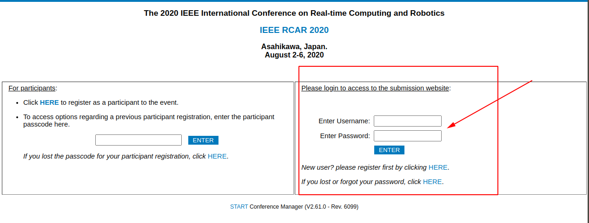
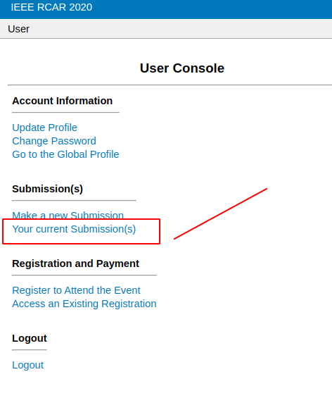
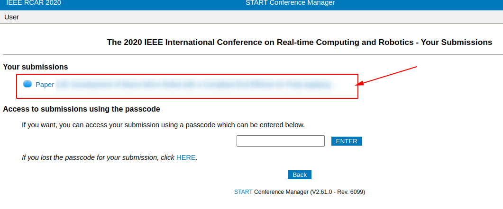
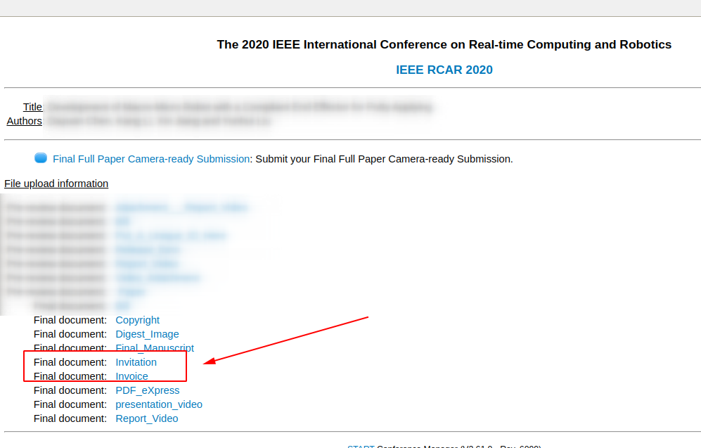

1. Visit softconf RCAR2020

    [Click here to visit rcar2020 softconf](http://www.softconf.com/j/rcar2020/)

2. Login in the submission website.

    

3. Click `Your current Submission(s)`

    

4. Choose your corresponding Paper.

    

5. Find `Final document: Invitation ` and `Final document Invoice`, then click it to download.

    
