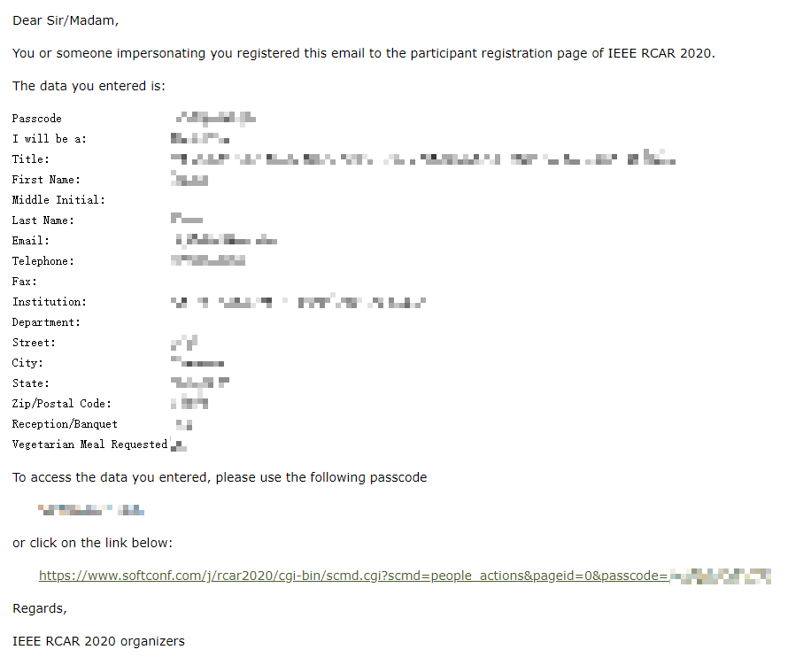
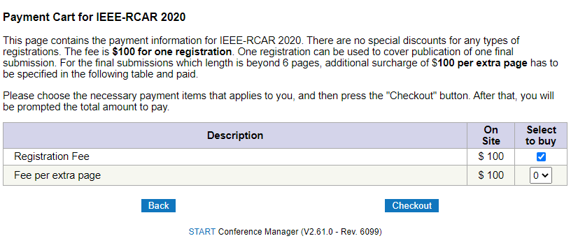
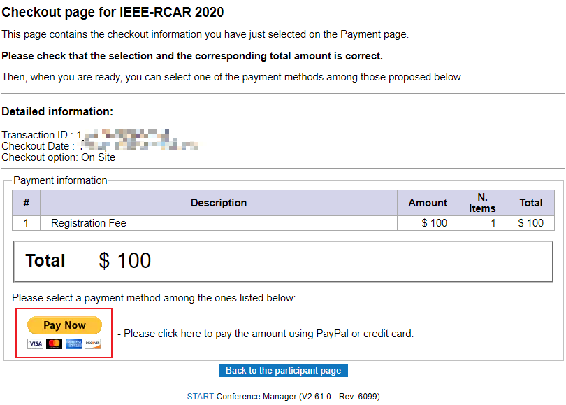
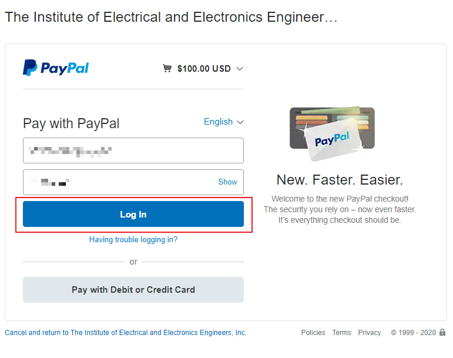
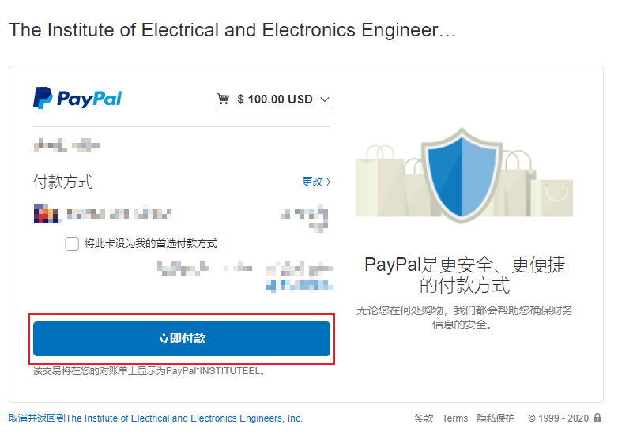
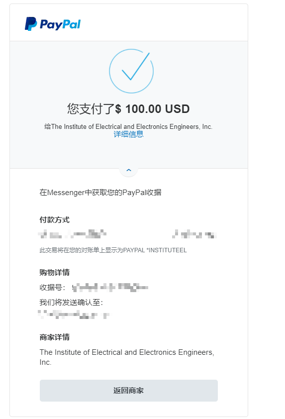
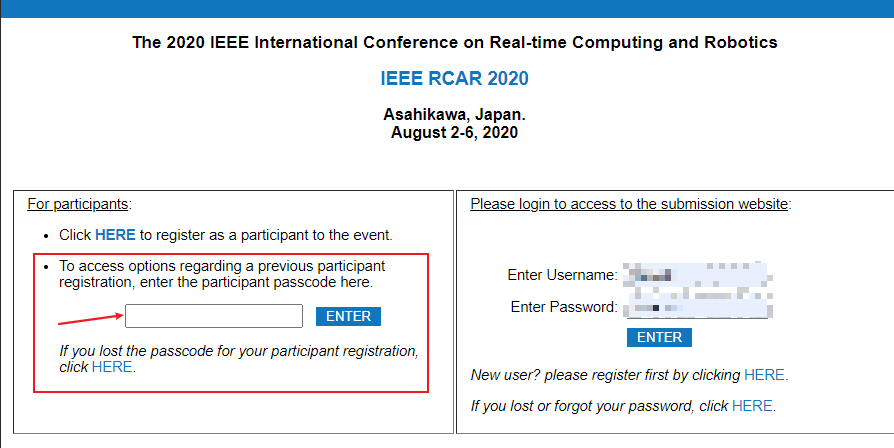
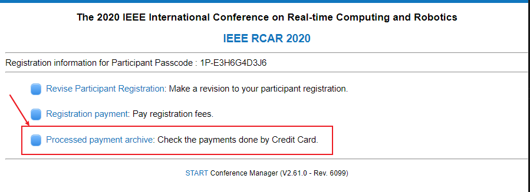
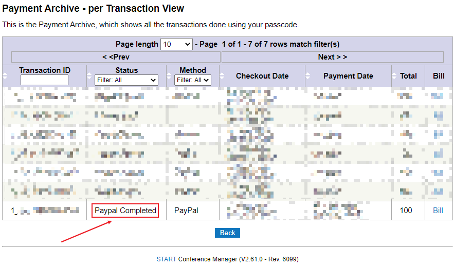

# How to Registration and Payment for IEEE-RCAR2020

## Contents

- [How to Registrate](#Rigistration)

- [How to Payment](#Payment)

- [Confirm whether the payment is successful](#Confirm)

## Rigistration 

1. visit [IEEE-RCAR2020](www.softconf.com/j/rcar2020)
2. Rigistrate
   
   

   or authors can registrate by login in

   
3. Fill in your profile in below texboxs. `* is mandatory`  
   

   Then click `Continue` to next `Payment` step

   >  **Here you will recevie a email with your registration `passcode`, you can use it to re-login.** like this
      

## Payment

1. Choose item you need to pay for

   **Note:** if your paper more than **6** pages, you need pay for extra pages than 6.

   

   Then click `Checkout` button.

2. Checkout your bill

   Here a Payment information will be shown. And a transaction ID is generated. 

   Click `Pay Now`

   

   > You will receive a bill email about this transaction.

3. Using your PayPal account to pay.

   

   Then click `Log In`.

4. Pay for this

   

5. Pay successful

   

## Confirm

1. Login in by your passcode

   

2. click `Processed payment archive`

   

3. Check table list

   

----

We are looking forward to see you at IEEE RCAR 2020!

Regards,

The IEEE RCAR 2020 committee.