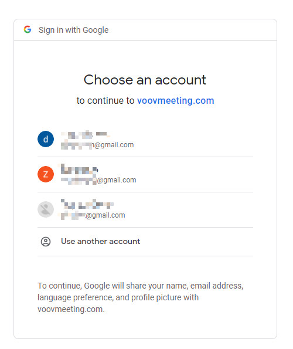
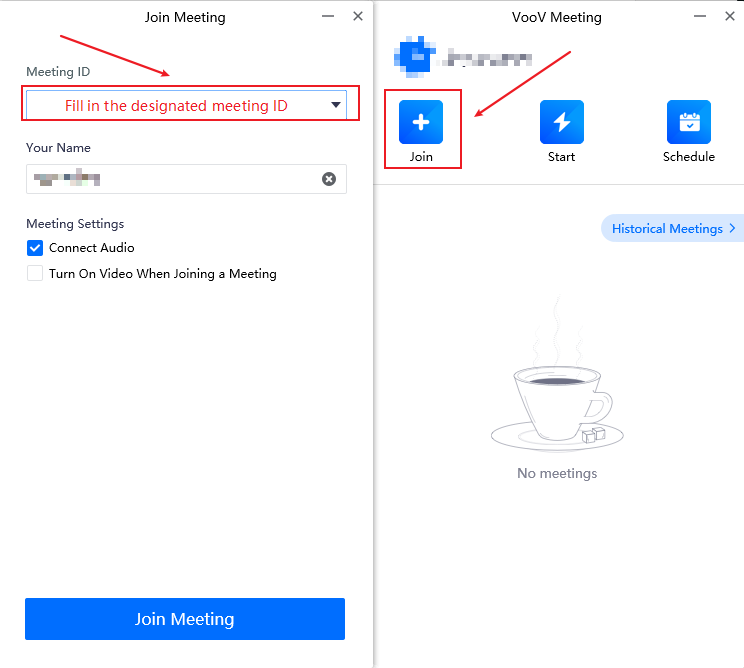

------

[**Note! Chinese authors please use this link, and use your WeChat account.**](https://meeting.tencent.com/download-center.html?from=1001)

-----

1. Download Tencent VooV Meeting.

    [Click here to download VooV.](https://www.voovmeeting.com/download-win.html?from=1002&fromSource=1)

2. Then choose your favorite way to Log in.

    - If you have a WeChat account, you can click here.

    

    - Otherwise you should use your Google account to Sign up.

    

    

3. Sign up

    

    Choose your Primary Location and Date of birth

4. Then Verify your phone number.

5. Join in the meeting.

    Please attend the designated meeting according to the meeting ID on the program schedule.

    

    [Program link is here.](https://www.ieee-rcar.com/#/Program)